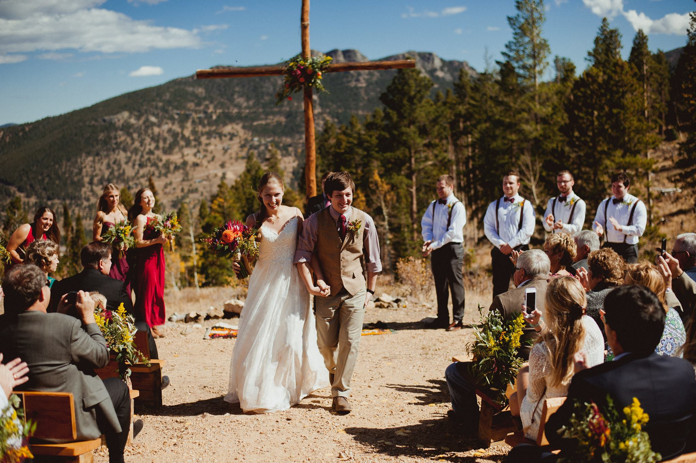

+++
slug="example"
draft = true
title = "First Blog Post"
description = "Wherein I describe how everything works."
summary = "I don't know what this summary field is for."
date = 2018-10-18
in_search_index = true
render = true
[taxonomies]
tags = ["exampletag"]
categories = ["examplecategory"]
[extra]
alttext = "Where it all began..."
# hidedate = true
toc = true
+++

# First.

Placeholder for where I describe the general setup... when I know what that's like.
In the meantime, take a look at my [projects](./projects/_index.md) and a wedding photo:



{{ vimeo(id="121712712") }}

```rust
let test = true;
```
